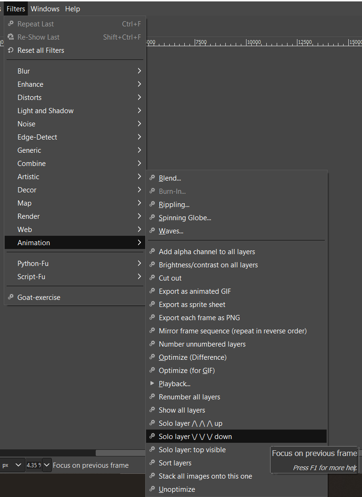

# Gimp-Python scripts for animation

## Introduction

GIMP is a good tool for animation, but it can be quite laborious to use it, involving a lot of repetitive clicks.  This plugin adds more commands to GIMP's Animation menu that help to speed up various animation tasks.

Author: Anthony Hayward.

## Compatibility

Tested with GIMP 2.10.12 on Windows.  No other plugins or extra software needed.

GIMP = GNU Image Manipulation Program, an open source graphics editor, available for free download at https://www.gimp.org/downloads/.

## Installation

1. Find the plugin directory for your user by clicking Edit > Preferences > Folders > Plug-ins and click the icon to "Show file location in the file manager"
2. Copy [python_animation_helper_plugin.py](python_animation_helper_plugin.py) into the directory.
3. Restart GIMP.

If GIMP is happy, you'll see new entries in the Filters > Animation menu:

## GIMP Dialogs

You will need the following GIMP dialogs from the "Windows > Dockable Dialogs" menu open all the time in the main GIMP window:

- Undo History
- Layers

If you don't like the result of any animation operation, use GIMP's Undo History and click above the list of changes made by the script to reverse its effect.

## Process

These commands are designed to help get animations that have been drawn on multiple bits of paper into GIMP as multiple layers within a single image, from where they can be exported as an animated GIF, or as separate images or a sprite grid for use in a game.

Of course, you can adapt this process and modify your copy of the Python code to suit your specific needs.

### Draw, scan and save

1. Draw animation frames on paper.  Write a frame number on each frame so you can keep track of them.
2. Scan each piece of paper into GIMP using "File > Create > From Scanner/Camera..."  (as a colour picture).  Try to have the orientation the same for each piece of paper; it doesn't have to be correct, just the same for each image at this point.
3. Run "Filters > Animation > Stack all images onto this one".  All the images get combined into one image as layers.
4. Use "Image > Transform" to rotate the image to the correct orientation.
5. Use "Image > Scale" to scale the image to the pixel dimensions you want.  It's best if the image fits on your screen at 100% zoom.
6. Save the image (in GIMP's `.xcf` format).
7. File > Close All and discard changes.  This is necessary because the Python-fu can't close your other now-empty images for you.
8. Reopen the GIMP file you just saved.

### Colour and outline

The scanned images often have poor contrast.  You can adjust the brightness / contrast of all layers simultaneously using "Filters > Animation > Brightness/contrast on all layers".

You might want more sophisticated enhancement, e.g. apply a colour curve or GIMP's Cartoon filter (Filters > Artistic > Cartoon...) which can ink your outlines for you.  Unfortunately you'll need to apply these manually to each layer separately.  You can use "Filters > Repeat" and "Filters > Recently Used" to apply the same enhancement after switching to the next layer.

If you have only drawn outlines, this is the time to colour in using GIMP's Flood Fill tool.

It's very easy to get confused between the top visible layer and the currently active (selected) layer.  The plugin provides some "Solo layer" commands to help:
- Solo layer up
- Solo layer down
- Solo layer: top visible
These commands hide all but one layer, and ensure the displayed layer is selected.  If you are stepping through multiple layers, you can use "Filters > Repeat Last" (Ctrl + F) to repeat the Solo layer up/down operation to step through the layers (unless you've applied a different filter following the last Solo layer up/down operation).

### Split and align layers if required

If you have multiple frames drawn on each sheet of paper, it's now time to split them into multiple layers.

1. Right-click on each layer in the Layers dialog and select "Duplicate Layer" until you have as many copies of the layer as there are frames in the layer.
2. Rename each layer with the frame number that the layer will represent.  E.g. if you have three copies of a layer that contains frames 1, 2 and 3, then you will end up with three copies of that layer called "1", "2" and "3".  To rename a layer, click it in the Layer dialog and press F2.
3. Create guide lines (by dragging down and across from the ruler) that you can use to align your frames.  Turn off "Snap to Guides" from the View menu.
4. Go through each layer and use the Move tool to shift the whole layer to line up the frames.  To select a single layer, use one of the "Filters > Animation > Solo layer *" commands.
5. Select a rectangle that contains all frame contents, and the Image > Crop to Selection.
6. Go through each layer (using the  "Filters > Animation > Solo layer down" command) and delete any mess around the edges, e.g. parts of other frames, using the usual GIMP drawing / selection tools.

### Sort frames

1. If you haven't already numbered the layers, rename each layer to have the frame number "1", "2" etc.  To rename a layer, click it in the Layer dialog (Windows > Dockable Dialogs > Layers) and press F2.
2. In the Python-fu console, run "Filters > Animation > Sort layers" to sort the frames from bottom to top.  Note: this also sets the layer size to the image size for each layer.

### Preview animation

1. Click "Filters > Animation > Playback...".  The Playback dialog opens.
2. If your images are transparent, change "Cumulative layers (combine)" to "One frame per layer (replace)".  If your images have no transparency, the options are equivalent.
3. Press the play icon to see your animation.
4. Change the "1x" option to see your animation at a different playback rate.  (You can change the "fps" option as well, but you need to close and re-open the dialog box for it to take effect).
5. Close the dialog when done.

### Export animation as animated GIF

You can run the command "Filters > Animation > Export as animated GIF" to save the animation as an animated GIF file.  Enter the desired frame rate and optionally a suffix for the filename.  The filename is the same as the `.xcf` filename of the animation, with the optional suffix and the extension `.gif`.

If you prefer to specify frame delay rather than frame rate, you can export an animated GIF using the File menu instead:

1. Click File > Export As...
2. Enter a filename ending in `.gif` and click Export.
3. Tick "As Animation".  You probably want "Loop forever" to stay ticked.
4. Enter the Delay in milliseconds.
5. Select Frame Disposal "One frame per layer (replace)".
6. Tick the two boxes at the bottom to apply the same Delay and Disposal to all frames.
7. Click Export, and wait.
8. When done, open the `.gif` file in a web browser to see the result.

GIMP can't save movie files, so you'll need other software if you want to convert your animated GIF to `.avi`, `.mp4` etc.

### Save animation as separate frames

"Filters > Animation > Export each frame as PNG"

Each frame is saved to a PNG file with its frame number as a suffix, e.g. `my_anim_01.png`, `my_anim_02.png`, `my_anim_03.png` etc.

### Save animation as sprite sheet

"Filters > Animation > Export as sprite sheet"

The frames are arranged in a rectangular grid.  Each grid cell is the size of the original image.  The frames run left-to-right then top-to-bottom.  The number of columns can be specified, or left as 0 in which case it is calculated so as to make the sprite sheet as square as possible.

The filename is the same as the `.xcf` filename of the animation, with a suffix indicating the number of frames and columns and the size of each grid cell, and the extension `.png`.

### Remove box around frame (transparent edge)

Your scans will be full white rectangles with no transparency.  To add an Alpha Channel to your frames and remove the surrounding blank white paper you've scanned, run "Filters > Animation > Cut out".  If this doesn't work well for you, you can add an alpha channel to each layer using "Filters > Animation > Add alpha channel to all layers" and then remove the surround on each layer manually.

After removing the outer boxing, run the command "Filters > Animation > Show all layers" to see all the frames overlaid on each other, then you can easily crop the image to a box that includes all the content in all the frames.

### Mirror the frames (reverse loop playback)

GIMP doesn't offer to reverse your animation when it's finished playing.  You can do this by copying each frame in reverse order, except the last one.  Run "Filters > Animation > Repeat frames backwards".

Note, the copied frame has no relationship to the original frame, so make sure any other editing is completed before doing this!  The copy gets a new incremental frame number that does not show its relationship to the original frame number.

### Numbering

The "Filters > Animation > Number unnumbered layers" command will assign an incremental numeric layer name to any layer that has a non-numeric name, while leaving layers that already have numeric names alone.  If there are multiple layers, they are numbered increasing from bottom to top.

The "Filters > Animation > Renumber all layers" command will rename all layers, starting from "1" at the bottom, then "2" etc.  Existing layer names are ignored.
